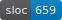

# About

Code explorer for the [Unison](https://www.unisonweb.org/) language. Inspired by [haskell-code-explorer](https://github.com/alexwl/haskell-code-explorer).

See it live [here](http://unison.readvar.com/).

# Status

Heavily WIP.

In addition to lots of minor issues there are three serious enough to mention here:

+ Back button support / URL entrypoints into app ([issue #5](https://github.com/seagreen/unison-code-explorer/issues/5))

+ Notify the user when the websocket disconnects ([issue #4](https://github.com/seagreen/unison-code-explorer/issues/4))

+ Auto-reconnect for a certain amount of time ([issue #6](https://github.com/seagreen/unison-code-explorer/issues/6))

# Technology

`unison-code-explorer` is built on [concur-replica](https://github.com/pkamenarsky/concur-replica).

Similar to [phoenix-liveview](https://github.com/phoenixframework/phoenix_live_view), `concur-replica` let's your write web UIs without any custom JavaScript. It does this by keeping a VDOM on the server for each user and sending updates to the user's browser over a websocket.

It's important to note that this is only a good fit under a the following conditions:

1. Instant user feedback isn't required (fine for CRUD apps, not fine for AAA games. [replica](https://github.com/pkamenarsky/replica) has client side prediction built-in for text but nothing else.)

2. Offline use not required

3. Not too animation heavy (since with this strategy animation is a bandwidth hog)

4. Your server can handle it

That sounds like a lot, but if you don't have any of those restrictions I think `concur-replica` is *incredibly* promising. You can do everything in a single language, don't have to write any JS, and have amazing concurrency primatives like green threads and STM at your fingertips. And since UI code is so annoying to test the type system really shines. Overall it's just fun.

# Use

1. `stack install`

2. `cd` to a directory containing a `.unison` codebase.

3. `unison-code-explorer`

4. Visit `localhost:8080` in your web browser.

# Static Docs Generation

`unison-code-explorer --static --dest docs`

Now you have documentation in the "docs" directory, this can be pushed to github (where github-pages can host it for you) or put somewhere else.